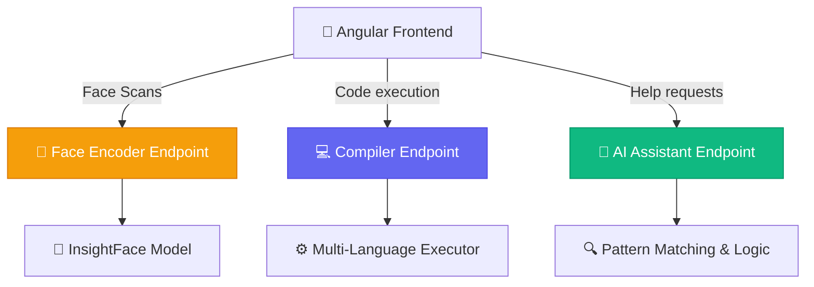

<div align="center">

# 🧠 ORBIT Python AI & Code Execution Service

<p>
  
  
  
  
</p>

<p>
  <strong>Providing Face Recognition, Multi-Language Code Compilation, and Smart Error Analysis</strong>
  <br />
  <em>The intelligent microservice powering students' coding environments and identity checks</em>
</p>

</div>

---

## ✨ Features

| Feature | Description |
|---------|-------------|
| 👤 **Face Encoding** | AI face analysis using InsightFace (`buffalo_l`) to generate stable biometric embeddings |
| 💻 **Code Execution** | Compiles and executes code in Python, Java, C, and C++ with isolated environments |
| 🤖 **Smart AI Fixes** | Detects common syntax errors (indentation, NameError) and provides clean, corrected code |
| 💡 **Code Suggestions** | Analyzes successful code to offer intelligent optimizations and best practice tips |

---

## 🚀 Quick Start

### Prerequisites
- Python 3.10+
- Models for InsightFace (auto-downloads on first run)

### 1️⃣ Installation

```bash
# Navigate to the python service directory
cd backend/python

# Create virtual environment and install dependencies
python -m venv venv
source venv/bin/activate  # On Windows: venv\Scripts\activate
pip install -r requirements.txt
```

### 2️⃣ Run the Server

```bash
# Start FastAPI server
uvicorn app:app --host 0.0.0.0 --port 8000 --reload
```

> **Production Deployed URL:** `https://orbit-afavcgereabweje3.eastasia-01.azurewebsites.net`

---

## 📡 Key API Routes

### biometric Encoding
- `POST /encode` - Upload an image to get a stable, normalized 512D face embedding

### Code Execution
- `GET /api/compiler/languages` - Get list of supported languages
- `POST /api/compiler/execute` - Send code and inputs for execution

### AI Guidance
- `POST /api/ai/generate` - Send code/errors to receive fixed code or optimization suggestions

---

## 🏗️ Architecture



---

<div align="center">

### Built with ❤️ for ORBIT

</div>
