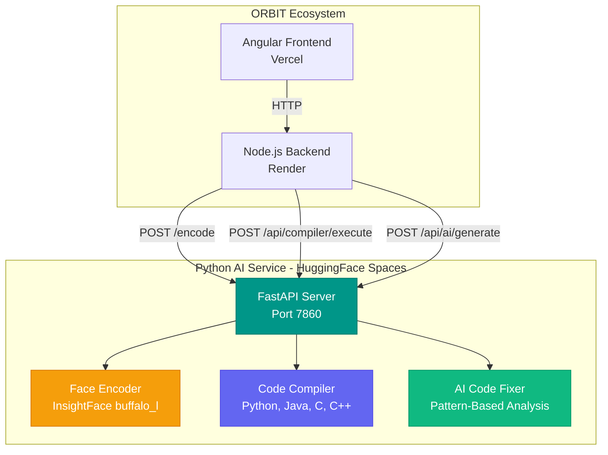

<div align="center">

# 🧠 ORBIT Python AI & Code Execution Service

<p>
  
  
  
  
  
</p>

<p>
  <strong>Providing Face Recognition, Multi-Language Code Compilation, and Smart Error Analysis</strong>
  <br />
  <em>The intelligent microservice powering students' coding environments and identity checks</em>
</p>

</div>

---

## 🔗 Deployment & Repositories

| Resource | Link |
|----------|------|
| **Live API** | [`https://srikar048-orbit-python-ai.hf.space`](https://srikar048-orbit-python-ai.hf.space) |
| **API Docs** | [`https://srikar048-orbit-python-ai.hf.space/docs`](https://srikar048-orbit-python-ai.hf.space/docs) |
| **GitHub Repo** | [`Srikarsanka/pythonfacerecognizationorbit`](https://github.com/Srikarsanka/pythonfacerecognizationorbit) |
| **HF Space** | [`srikar048/orbit-python-ai`](https://huggingface.co/spaces/srikar048/orbit-python-ai) |
| **Parent Project** | [`Srikarsanka/orbitai`](https://github.com/Srikarsanka/orbitai) |

---

## ✨ Features

| Feature | Description |
|---------|-------------|
| 👤 **Face Encoding** | AI face analysis using InsightFace (`buffalo_l`) to generate stable 512-dimensional biometric embeddings |
| 💻 **Code Execution** | Compiles and executes code in Python, Java, C, and C++ with sandboxed environments |
| 🤖 **Smart AI Fixes** | Detects common syntax errors (indentation, NameError, missing colons) and provides corrected code |
| 💡 **Code Suggestions** | Analyzes successful code to offer intelligent optimizations and best practice tips |

---

## 🏗️ Architecture


```mermaid
graph TD
    subgraph ORBIT Ecosystem
        FE["Angular Frontend<br/>Vercel"]
        BE["Node.js Backend<br/>Render"]
    end

    subgraph Python AI Service - HuggingFace Spaces
        FastAPI["FastAPI Server<br/>Port 7860"]
        Face["Face Encoder<br/>InsightFace buffalo_l"]
        Compiler["Code Compiler<br/>Python, Java, C, C++"]
        AIFix["AI Code Fixer<br/>Pattern-Based Analysis"]
    end

    FE -->|HTTP| BE
    BE -->|POST /encode| FastAPI
    BE -->|POST /api/compiler/execute| FastAPI
    BE -->|POST /api/ai/generate| FastAPI

    FastAPI --> Face
    FastAPI --> Compiler
    FastAPI --> AIFix

    style FastAPI fill:#009688,color:#fff,stroke:#00796b
    style Face fill:#f59e0b,color:#fff,stroke:#d97706
    style Compiler fill:#6366f1,color:#fff,stroke:#4f46e5
    style AIFix fill:#10b981,color:#fff,stroke:#059669
```

### How Face Recognition Works

```
┌──────────────────────────────────────────────────────────┐
│                 FACE ENCODING PIPELINE                    │
├──────────────────────────────────────────────────────────┤
│                                                           │
│  1. 📷 CAPTURE         User uploads face image            │
│        │                                                  │
│  2. 🖼️ PREPROCESS      PIL converts to RGB numpy array    │
│        │                                                  │
│  3. 🔍 DETECT          InsightFace det_10g.onnx model     │
│        │                finds face bounding box           │
│        │                                                  │
│  4. 🧬 ENCODE          w600k_r50.onnx generates a         │
│        │                512-dimensional embedding vector   │
│        │                                                  │
│  5. 📤 RETURN          Normalized unit vector returned     │
│                         for cosine similarity matching     │
│                                                           │
└──────────────────────────────────────────────────────────┘
```

### Where It's Used in ORBIT

| Use Case | Flow |
|----------|------|
| **Signup** | Student uploads face → Python encodes → Embedding saved to MongoDB |
| **Login** | Student captures face → Python encodes → Cosine similarity check against stored embedding |
| **Video Call Verification** | Student joins call → Live face capture → Python encodes → Verifies identity |
| **Attendance** | During class → Periodic face capture → Python encodes → Marks attendance |

---

## 📡 API Endpoints

| Method | Endpoint | Description |
|--------|----------|-------------|
| `POST` | `/encode` | Upload an image, returns 512D face embedding |
| `POST` | `/api/compiler/execute` | Execute code in Python/Java/C/C++ |
| `GET` | `/api/compiler/languages` | List supported programming languages |
| `POST` | `/api/ai/generate` | Smart error fixing & code suggestions |

### Example: Face Encoding

```bash
curl -X POST https://srikar048-orbit-python-ai.hf.space/encode \
  -F "file=@student_face.jpg"
```

**Response:**
```json
{
  "embedding": [0.0234, -0.0891, 0.0412, ... ] // 512 values
}
```

### Example: Code Execution

```bash
curl -X POST https://srikar048-orbit-python-ai.hf.space/api/compiler/execute \
  -H "Content-Type: application/json" \
  -d '{"language": "python", "code": "print(\"Hello ORBIT!\")", "input": ""}'
```

---

## 🚀 Local Development

```bash
# Navigate to the python service directory
cd backend/python

# Create virtual environment and install dependencies
python -m venv venv
source venv/bin/activate  # On Windows: venv\Scripts\activate
pip install -r requirements.txt

# Start FastAPI server
uvicorn app:app --host 0.0.0.0 --port 8000 --reload
```

## 🐳 Docker Deployment

```bash
docker build -t orbit-python-ai .
docker run -d --name orbit-py -p 8000:8000 orbit-python-ai
```

---

## 📂 Project Structure

```
python/
├── 📄 app.py                 # FastAPI app — face encoding + compiler + AI
├── 📄 code_executor.py       # Multi-language code execution engine
├── 📄 face_encode.py         # Standalone face encoding utility
├── 📄 requirements.txt       # Python dependencies
├── 🐳 Dockerfile             # Docker build (HuggingFace-compatible)
├── 📄 test_ai.py             # AI endpoint tests
├── 📄 test_ai_fixes.py       # Code fix verification tests
└── 📄 test_nameerror.py      # NameError detection tests
```

---

<div align="center">

### Built with ❤️ for ORBIT Virtual Classroom

**Deployed on [Hugging Face Spaces](https://huggingface.co/spaces/srikar048/orbit-python-ai)**

</div>
